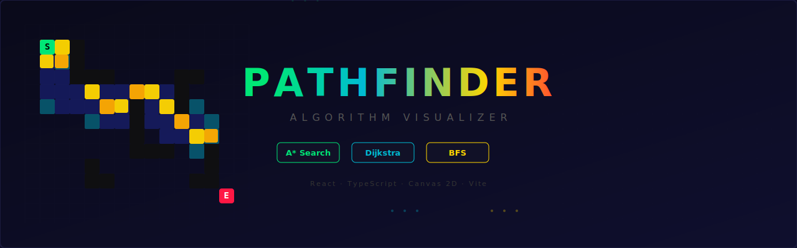

<div align="center">



<br/>
<br/>

# 🧭 Pathfinder — Algorithm Visualizer

**Visualiza A\*, Dijkstra y BFS paso a paso en un grid interactivo.**

[](https://react.dev)
[](https://www.typescriptlang.org)
[](https://vitejs.dev)
[](./LICENSE)

<a href="https://sergioballesta.github.io/pathfinder-viz/" target="_blank">
  
</a>

[Demo en vivo](#-demo) · [Instalación](#-instalación) · [Algoritmos](#-algoritmos) · [Controles](#-controles)

</div>

---

## ✨ Características

- 🎮 **Grid interactivo 28×22** — dibuja muros, coloca inicio/meta con el ratón
- 🧠 **3 algoritmos** — A\* (heurística Manhattan/Octile), Dijkstra, BFS
- 🎬 **Animación paso a paso** — observa cómo el algoritmo explora el grafo en tiempo real
- ⚡ **Control de velocidad** — slider de 1 a 20 para ajustar el ritmo
- 🔀 **Movimiento diagonal** — activa/desactiva 4 vs 8 direcciones
- 🏗️ **Generador de laberintos** — recursive backtracker automático
- 🎲 **Muros aleatorios** — scatter de obstáculos con densidad 30%
- 📊 **Estadísticas en tiempo real** — celdas exploradas, longitud del camino, tiempo de ejecución
- ⌨️ **Atajos de teclado** — productividad máxima sin tocar el ratón

## 📸 Screenshots

<div align="center">

| A\* resolviendo un laberinto | Dijkstra explorando | BFS completado |
|:---:|:---:|:---:|
| El algoritmo navega eficientemente con heurística | Exploración uniforme sin heurística | Búsqueda por amplitud capa a capa |

</div>

> 💡 **Tip:** Genera un laberinto con el botón `⊞ Laberinto` y compara cómo cada algoritmo lo resuelve.

## 🚀 Instalación

### Requisitos

- [Node.js](https://nodejs.org/) 18+
- npm, yarn o pnpm

### Setup

```bash
# Clonar el repositorio
git clone https://github.com/tu-usuario/pathfinder-viz.git
cd pathfinder-viz

# Instalar dependencias
npm install

# Iniciar servidor de desarrollo
npm run dev
```

La app estará disponible en `http://localhost:5173`

### Build para producción

```bash
npm run build
npm run preview  # Vista previa local del build
```

Los archivos estáticos se generan en `dist/` — puedes desplegarlos en cualquier hosting estático (Vercel, Netlify, GitHub Pages, etc).

## 🧠 Algoritmos

### A\* Search

El más eficiente de los tres. Combina la distancia recorrida (`g`) con una estimación heurística al destino (`h`):

```
f(n) = g(n) + h(n)
```

- **4 direcciones:** heurística Manhattan → `|dx| + |dy|`
- **8 direcciones:** heurística Octile → `max(dx,dy) + (√2−1) × min(dx,dy)`
- **Garantiza** camino óptimo con heurísticas admisibles

### Dijkstra

Caso especial de A\* donde `h(n) = 0`. Explora uniformemente en todas direcciones:

- **Sin heurística** — no tiene "intuición" sobre dónde está el destino
- **Garantiza** camino más corto (con pesos)
- Útil como **baseline** para comparar la eficiencia de A\*

### BFS (Breadth-First Search)

Búsqueda por amplitud sin costes ponderados:

- Trata todas las aristas con **coste 1**
- Ideal para **grids sin pesos** (donde diagonal = recto)
- El más simple conceptualmente — perfecto para **fines educativos**

## 🎮 Controles

### Ratón

| Acción | Efecto |
|--------|--------|
| Click izquierdo | Colocar celda según herramienta activa |
| Arrastrar | Pintar múltiples celdas |
| Click derecho | Bloqueado (evita menú contextual) |

### Teclado

| Tecla | Acción |
|-------|--------|
| `1` | Herramienta: Muro |
| `2` | Herramienta: Inicio |
| `3` | Herramienta: Meta |
| `4` | Herramienta: Borrador |
| `Espacio` | Ejecutar algoritmo |

### Leyenda de colores

| Color | Significado |
|-------|-------------|
| 🟢 Verde | Celda de inicio (S) |
| 🔴 Rojo | Celda destino (E) |
| ⬛ Negro | Obstáculo / muro |
| 🔵 Cian | Frontera (por explorar) |
| 🔷 Azul oscuro | Celda explorada |
| 🟡 Amarillo | Camino final encontrado |

## 📂 Estructura del proyecto

```
src/
├── algorithms/
│   ├── astar.ts          # A* con MinHeap + heurística adaptativa
│   ├── bfs.ts            # Breadth-First Search
│   ├── dijkstra.ts       # Dijkstra con MinHeap
│   ├── index.ts          # Barrel exports
│   └── types.ts          # Tipos compartidos (Grid, Coord, AlgoStep...)
├── components/
│   ├── Controls.tsx      # Selector de algoritmo, herramientas, acciones
│   ├── Grid.tsx          # Canvas wrapper con overlay "SIN CAMINO"
│   ├── Legend.tsx         # Leyenda de colores
│   └── Stats.tsx         # Estadísticas en tiempo real
├── hooks/
│   ├── useCanvas.ts      # Renderizado Canvas 2D + eventos de ratón
│   └── usePathfinding.ts # Estado global + lógica de animación
├── utils/
│   ├── MinHeap.ts        # Binary min-heap (priority queue)
│   ├── constants.ts      # Colores, dimensiones, configuración
│   ├── grid.ts           # Crear/limpiar/generar grids y laberintos
│   └── heuristics.ts     # Manhattan + Octile distance
├── App.tsx               # Componente raíz
├── index.css             # Estilos globales + reset
├── main.tsx              # Entry point React
└── vite-env.d.ts         # Tipos Vite
```

## 🏗️ Decisiones técnicas

| Decisión | Razón |
|----------|-------|
| **Canvas 2D** en vez de SVG/DOM | Rendimiento: renderizar 616+ celdas por frame sin layout thrashing |
| **Generator functions** para algoritmos | Permiten `yield` en cada paso → animación natural sin callbacks complejos |
| **MinHeap propia** | Sin dependencias externas; O(log n) push/pop vs O(n log n) de Array.sort |
| **Sin Tailwind** | Inline styles para zero-config; el proyecto es self-contained |
| **Ref mutable** para el grid | Evita re-renders innecesarios durante la animación; setState solo para UI |

## 🗺️ Roadmap

- [ ] **Batalla side-by-side** — compara 2 algoritmos simultáneamente
- [ ] **Greedy BFS** — heurística sin `g(n)`, no óptimo pero rápido
- [ ] **Jump Point Search** — optimización de A\* para grids uniformes
- [ ] **Celdas con peso** — terrenos con coste variable
- [ ] **Exportar/importar** — guardar grids como JSON
- [ ] **Dark/Light mode** — toggle de tema
- [ ] **Responsive mobile** — touch events para móvil
- [ ] **Deploy en GitHub Pages** — CI/CD con GitHub Actions

## 📜 Licencia

[MIT](./LICENSE) — úsalo, modifícalo, compártelo libremente.

---

<div align="center">

Hecho con ☕ y curiosidad por algoritmos.

**[⬆ Volver arriba](#-pathfinder--algorithm-visualizer)**

</div>
